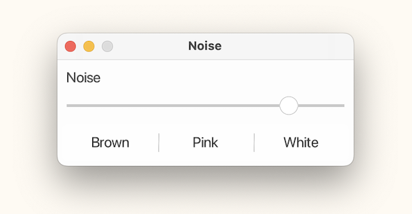
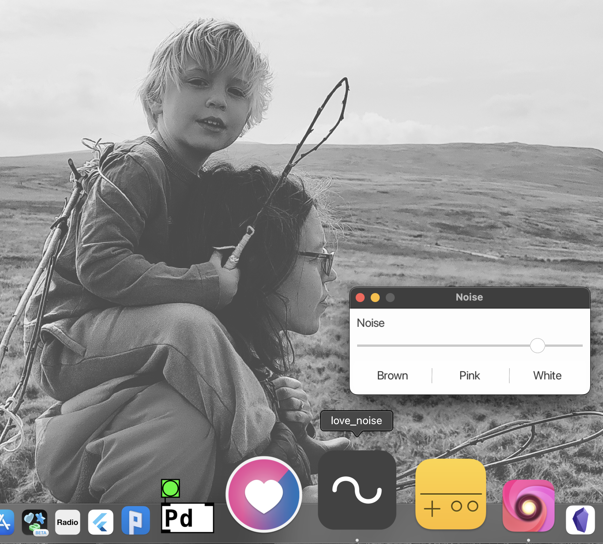

# LÖVE Noise

A brown/pink/white noise generator written in Love2D/LÖVE. 

## Install - MacOS

* Download [love_noise.zip](https://github.com/orllewin/love2d_noise/blob/main/_macos_dist/love_noise.zip?raw=true) and decompress
* On first run right-click the love_noise app icon and select `Open`, when the security popup appears click `Open`. This only needs to be done the first time
* On MacOS Ventura you might need to repeat the above step before you get the `Open` option (because Apple are hostile to anything installed outside the App Store) 

## Install - All Platforms

* Install [LÖVE](https://love2d.org/) and [add to path](https://love2d.org/wiki/Getting_Started)
* Download [love_noise.love](./love_noise.love) and double-click

## Build

* Install [LÖVE](https://love2d.org/) and [add to path](https://love2d.org/wiki/Getting_Started)
* Clone the repo
* Open in [Nova](https://nova.app/)
* Create a custom run task: `open -n -a love ./`
* Command-R to run (MacOS)

## Distribute

### .love

Select the project files and compress as zip with main.lua at the root, change the file extension to .love

### MacOS

* Replace the love_noise.love in `_macos_dist/love_noise.app/Contents/Resources` with the new version.
* Create news .icns file using [cloudconvert.com/png-to-icns](https://cloudconvert.com/png-to-icns)
